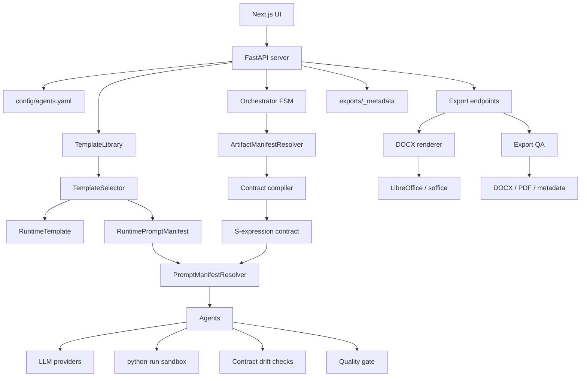

# Архитектура Системы

**Academic Pipeline Engine** построен как локально запускаемый агентный workspace: FastAPI backend управляет конфигурацией, оркестрацией и экспортом, Next.js frontend показывает живой ход работы, а доменная логика разделена между template, manifest, contract, agent и tool слоями.

Главный принцип архитектуры: пользовательский запрос сначала превращается в явный runtime contract, а уже потом попадает к агентам. Это защищает проект от старого academic-first поведения, где любой запрос рисковал превратиться в исследовательскую статью.

## Компонентная Диаграмма



## Основные Слои

### UI (`ui/`)

Next.js workspace для запуска генерации и работы с результатами:

- prompt input, template mode и academic/standard controls;
- prompt enhancement и artifact override;
- live document canvas;
- FSM monitor с SSE-статусами;
- console panel;
- config editor;
- history, archive/delete, continuation from previous work;
- profile modal, nickname/author metadata, theme/language controls;
- DOCX/PDF export и download actions.

UI получает backend state через `GET /api/status` и `GET /api/status/stream`.

### API (`academic_pe/server.py`)

FastAPI слой отвечает за HTTP-контракт:

- чтение и сохранение `config/agents.yaml`;
- запуск background pipeline;
- cancel текущего запуска;
- SSE stream;
- prompt enhancement;
- список шаблонов;
- secrets и model listing;
- draft/export/history metadata;
- DOCX/PDF export.

`server.py` не должен содержать manifest selection, contract compilation или adapter policy. Он вызывает доменные API и сохраняет результат.

### Configuration (`academic_pe/core/config.py`, `config/`)

Конфигурация валидируется через Pydantic V2. Главный runtime-файл - `config/agents.yaml`, который создается из `config/agents.example.yaml`.

Дополнительные источники данных:

- `config/document_templates.yaml` - сохраненные шаблоны документов и prompt manifests;
- `config/artifact_manifests.yaml` - типы артефактов, режимы, ограничения и fallback;
- `config/frontend_schema.json` - JSON Schema для UI config editor;
- `config/secrets.json` - локальные секреты, игнорируемые Git.

### Template Layer (`academic_pe/core/templates.py`)

Template слой отделяет структуру документа от глобального pipeline config.

- `DocumentTemplate` - сохраненный шаблон из YAML.
- `RuntimeTemplate` - snapshot структуры на конкретный запуск.
- `PromptManifest` - template-specific роли, задачи, стиль, rubric и output constraints.
- `RuntimePromptManifest` - snapshot prompt manifest на конкретный запуск.
- `TemplateLibrary` - file-backed библиотека шаблонов.
- `TemplateSelector` - выбор `custom`, `fixed` или `auto`.

`auto` режим использует `PlannerAgent`, но Planner не пишет документ: он планирует структуру и prompt manifest.

### Manifest And Contract Layer

Manifest слой определяет, какой артефакт просит пользователь: poem, story, school essay, academic paper, technical README, plan, report, continuation или unknown/freeform.

Contract слой компилирует manifest в явные runtime constraints:

- artifact type;
- language;
- execution mode;
- style/audience/structure;
- required/forbidden clauses;
- visualization policy;
- continuation preservation rules;
- compact decision summary.

S-expression contract передается агентам как декларативный блок. Это данные, не исполняемый код.

### Agent Layer (`academic_pe/agents`, `academic_pe/agent_adapters`)

Агенты создаются из `AgentConfig` через factory и получают уже собранный system prompt:

- base prompt из `agents.yaml`;
- template prompt manifest;
- artifact contract;
- agent-specific contract guidance.

Ключевые агенты:

- `WriterAgent` - планирование, черновики, revision, line patches;
- `ReviewerAgent` - external qualitative gate;
- `PlannerAgent` - runtime templates для `auto`;
- `PromptEnhancerAgent` - уточнение пользовательского brief;
- `example_generator` - dynamic examples и prompt enhancement backend.

Self-critique включается через `self_critique.enabled` и остается внутренним one-pass repair, а не отдельным блокирующим Reviewer.

### Orchestrator (`academic_pe/core/orchestrator.py`)

Оркестратор управляет FSM:

```text
INIT -> PLANNING -> DRAFTING -> REVIEWING -> RENDERING -> DONE
```

Он отвечает за:

- выбор runtime template;
- применение manifest/contract metadata;
- создание агентов;
- document plan;
- секционное drafting;
- sandbox execution для `python-run` блоков;
- reviewer loop;
- line-based patch revision;
- quality gate и contract drift checks;
- hooks для UI/SSE;
- cancellation.

В FastAPI workflow оркестратор запускается с `render_artifact=False`: состояние `RENDERING` означает завершение внутреннего draft pipeline, а реальные DOCX/PDF файлы создаются отдельными export endpoint'ами.

### Tool Layer (`academic_pe/tools`)

Инструменты детерминированы и не принимают творческих решений:

- `docx_renderer.py` создает DOCX из секций и стилей;
- `export_qa.py` проверяет структуру экспорта, имена файлов, DOCX/PDF результат;
- `libreoffice.py` ищет `soffice` для PDF conversion.

### Storage

Текущая реализация простая и локальная:

- active run state - in-memory `current_run`;
- run artifacts - `exports/<run_id>/`;
- draft/export history metadata - `exports/_metadata/*.metadata.json`;
- secrets - `config/secrets.json`.

Это сознательный local-dev слой. Для production-режима логичная эволюция - выделить интерфейсы `RunStore`, `EventBus`, `JobQueue` и заменить in-memory/file-backed части на PostgreSQL/Redis adapters.

## Структура Директорий

```text
.
├── academic_pe/
│   ├── agent_adapters/    # agent-specific manifest/contract guidance
│   ├── agents/            # agent implementations and factory
│   ├── contracts/         # contracts, S-expression renderer, drift checks
│   ├── core/              # orchestration, config, LLM, templates, sandbox
│   ├── manifests/         # manifest models, loader, resolver, fallback
│   ├── tools/             # DOCX/PDF/export utilities
│   ├── api_models.py
│   └── server.py
├── assets/
├── config/
├── docs/
├── scripts/
├── tests/
├── ui/
├── exports/
├── Dockerfile
├── docker-compose.yml
├── pyproject.toml
└── README.md
```

## Границы Ответственности

- `academic_pe.manifests` выбирает и композирует manifest, но не рендерит prompts и не вызывает LLM.
- `academic_pe.contracts` валидирует и компилирует contracts, но не читает YAML и не вызывает агентов.
- `academic_pe.agent_adapters` переводит contract в agent-specific guidance, но не выбирает manifest.
- `academic_pe.core.prompt_manifest_resolver` собирает system prompts детерминированно.
- `academic_pe.core.orchestrator` координирует pipeline, но не дублирует heuristics resolver'ов.
- `academic_pe.server` обслуживает HTTP/state/history, но не содержит domain policy.
- `academic_pe.tools` выполняет рендеринг и QA без LLM-решений.
