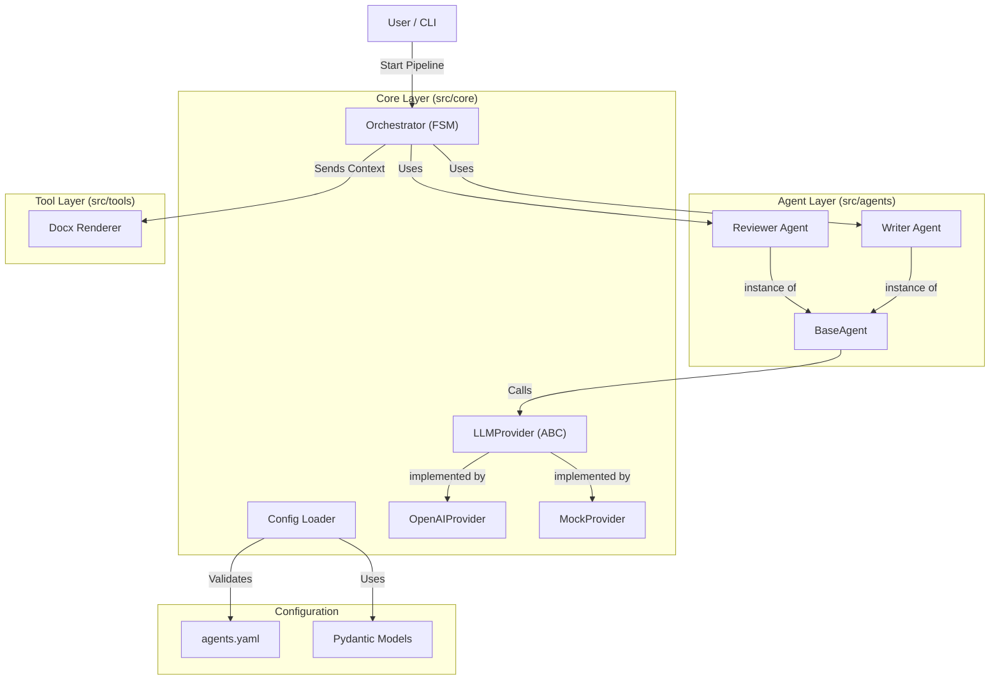

# Архитектура Системы (System Architecture)

Проект **Academic Pipeline Engine** построен на принципах **Clean Architecture** и модульности. Основная цель — отделить бизнес-логику (оркестрацию) от конкретных реализаций (инструменты, LLM) и конфигурации.

## Высокоуровневая диаграмма (Component Diagram)



## Описание Компонентов

### 1. Core Layer (`src/core`)
Ядро системы. Здесь содержатся механизмы, не зависящие от конкретного документа:
*   **Orchestrator:** Реализует конечный автомат (FSM) с таблицей переходов и guards. Управляет потоком выполнения через Dependency Injection.
*   **LLMProvider (ABC):** Абстрактный контракт для LLM-провайдеров. Позволяет переключать модели без изменения кода.
*   **OpenAIProvider:** Реализация для OpenAI API. Требует `OPENAI_API_KEY`.
*   **MockProvider:** Заглушка для тестов и разработки без API-ключа.
*   **Config Loader:** Загрузка и строгая типизация YAML-конфигурации через Pydantic V2.

### 2. Agent Layer (`src/agents`)
Слой бизнес-логики агентов.
*   **BaseAgent:** Базовый класс, инкапсулирующий формирование промптов и вызов LLM через `LLMProvider`.
*   **Конфигурируемые экземпляры:** Writer и Reviewer создаются из одного класса `BaseAgent` с разными конфигами из YAML.

### 3. Tool Layer (`src/tools`)
Слой инструментов ("Руки" системы).
*   **Docx Renderer:** Модуль, отвечающий за создание файла `.docx`. Ничего не "придумывает", только верстает переданный контент.

## Структура Директорий

```text
.
├── assets/                 # Логотипы и графика
├── config/                 # Конфигурационные файлы (YAML, JSON Schema)
├── docs/                   # Техническая документация
├── scripts/                # Утилиты (например, экспорт схемы)
├── src/
│   ├── agents/             # Реализация агентов
│   ├── core/               # Ядро системы (Оркестратор, Конфиг, LLM)
│   └── tools/              # Инструменты генерации
├── tests/                  # Unit-тесты
├── pyproject.toml          # Управление зависимостями (Poetry)
└── README.md               # Точка входа
```
