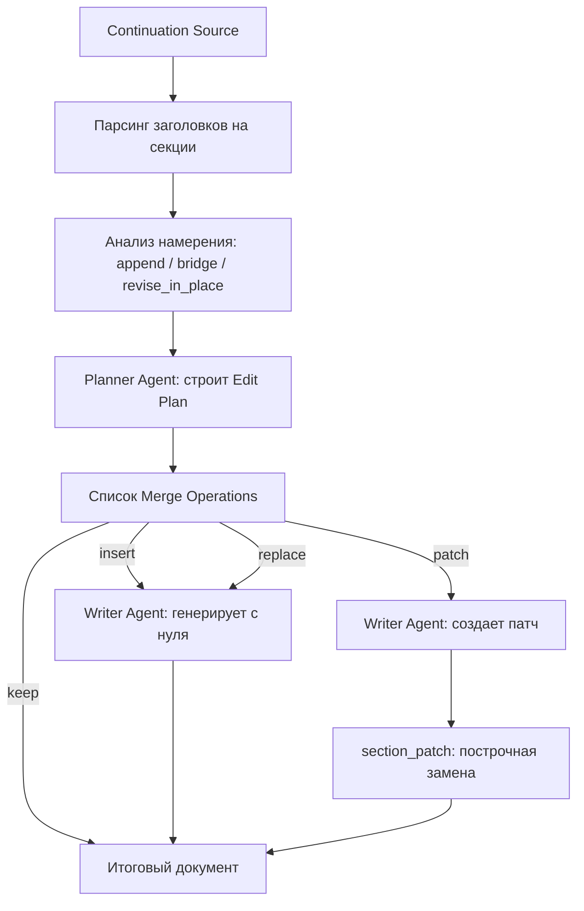

# Продолжение Написания и Слияние Документов (Continuation & Merge Flow)

Функционал **Continuation** позволяет использовать существующие документы (загруженные пользователем в Markdown/DOCX или созданные в прошлых сессиях) как основу для продолжения генерации, внесения правок или дополнения новых разделов.

Архитектура системы исключает слепое дописывание текста в конец файла, а использует направленный механизм слияния на основе метаданных планирования.

---

## 1. Входные данные (Continuation Source)

Входящий документ передается в пайплайн через объект `continuation_source`, содержащий:
- `content`: сырой текст документа;
- `context`: словарь распарсенных разделов (ключ — имя секции в snake_case, значение — текст секции);
- `instructions`: пользовательские инструкции по доработке/продолжению;
- `intent_override`: принудительное переопределение интента.

Разделение текста на секции происходит автоматически на основе заголовков Markdown первого и второго уровней (`#` и `##`).

---

## 2. Определение намерений (Editorial Intent Detection)

Модуль [`continuation.py`](../academic_pe/core/continuation.py) анализирует входящий контекст и инструкции пользователя, классифицируя задачу в один из трех типов (`EditorialIntent`):

1. **`append`** (дописать в конец): Требуется добавить новый контент после существующих разделов.
2. **`bridge`** (связать/заменить финал): Требуется переписать или расширить концовку существующего документа (например, если обнаружен "закрытый финал" вроде фразы *«The end»* или *«Таким образом, задача решена»*).
3. **`revise_in_place`** (отредактировать на месте): Инструкции просят улучшить, переписать или исправить существующие разделы без добавления новых (например, *"Improve this essay"* или *"Fix grammar"*).

---

## 3. План редактирования и операции слияния (Edit Plan & Merge Operations)

Оркестратор передает структуру документа и определенное намерение в `PlannerAgent`. Планировщик строит **План редактирования (`EditPlan`)**, который состоит из последовательности элементарных операций слияния (`MergeOperation`):

- **`keep`**: оставить раздел без изменений;
- **`insert`**: добавить новый раздел в указанную позицию;
- **`replace`**: полностью заменить содержимое существующего раздела новой генерацией;
- **`patch`**: применить точечные изменения к существующему разделу (используется для ревизий и локальных правок).

Интерфейс операций описан в [`merge_operations.py`](../academic_pe/core/merge_operations.py).

---

## 4. Точечные патчи разделов (Section Patching Flow)

Для операции `patch` агент-писатель (`WriterAgent`) генерирует не весь раздел заново, а создает патч в виде набора инструкций замены строк.

Модуль [`section_patch.py`](../academic_pe/core/section_patch.py) применяет эти инструкции построчно к исходному тексту:
1. Исходному тексту временно присваиваются номера строк.
2. Писатель возвращает блок заменяемого текста и блок нового текста.
3. Система ищет точное совпадение заменяемого фрагмента (включая пробелы) в указанном диапазоне строк и производит замену.
4. В случае несовпадения генерируется `SectionPatchError`, и пайплайн уходит на автоматический повторный круг генерации с сообщением об ошибке позиционирования строки.

## Схема процесса продолжения

Этот подход гарантирует, что при доработке больших документов сохраняется контекст и структура, а траты токенов на контекстное окно сводятся к минимуму.
