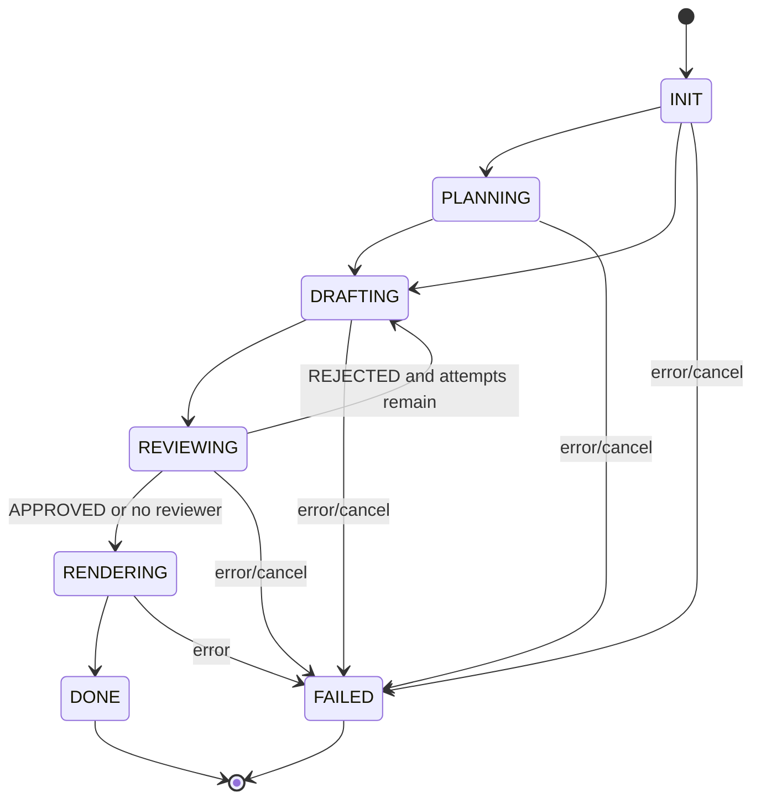
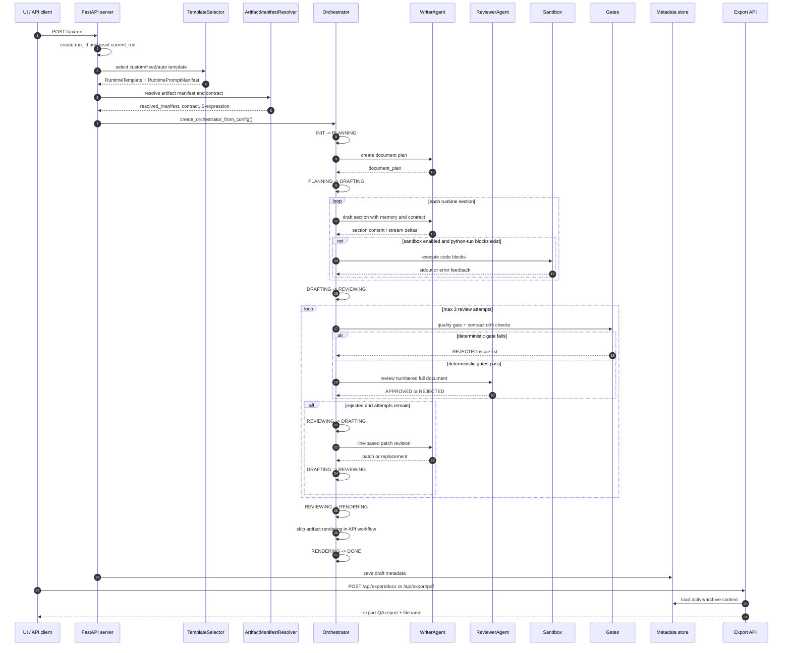

# Оркестрация и Поток Выполнения

Оркестратор (`academic_pe/core/orchestrator.py`) реализует finite state machine для подготовки черновика. Он не является HTTP-сервером и не хранит долговременную историю: сервер оборачивает его в background run, подписывает UI на события и сохраняет metadata.

## State Machine



`INIT -> DRAFTING` остается допустимым переходом для совместимости, но нормальный современный путь проходит через `PLANNING`.

## Runtime Sequence



## Состояния

| State | Назначение |
|---|---|
| `INIT` | Начальное состояние оркестратора после создания агентов и runtime metadata. |
| `PLANNING` | Writer/Planner строит document plan с учетом template, manifest, continuation и языка. |
| `DRAFTING` | Writer генерирует секции, получает memory о предыдущих секциях и стримит изменения. |
| `REVIEWING` | Deterministic gates и Reviewer проверяют результат; reject запускает revision loop. |
| `RENDERING` | Финальный внутренний этап. В API workflow реальный файл не создается, потому что export explicit. |
| `DONE` | Черновик готов и сохранен в history metadata. |
| `FAILED` | Ошибка или отмена. Для отмены сервер выставляет status `CANCELLED`, а state становится `CANCELLED`. |

## Drafting

Для каждой runtime-секции оркестратор рендерит `DEFAULT_DRAFT_TEMPLATE` с контекстом:

- target language;
- user topic и instructions;
- continuation source;
- active document plan;
- already written sections;
- execution mode;
- visualization policy;
- output directory.

Если active contract требует вычислительный режим или visualization, блоки вида:

````markdown
```python-run
print("computed result")
```
````

выполняются через `academic_pe/core/sandbox.py`. Успешный stdout заменяет блок в тексте; traceback возвращается Writer'у как feedback для следующей попытки.

## Review Loop

Review loop объединяет deterministic checks и LLM Reviewer:

1. `quality_gate.run_all()` проверяет объем, LaTeX и raw code fence artifacts.
2. `contracts.drift.run_all()` проверяет contract drift.
3. Если deterministic checks прошли, Reviewer получает пронумерованный полный документ.
4. Reviewer возвращает `APPROVED` или `REJECTED`.
5. При reject причины группируются по секциям.
6. Writer сначала пытается line-based patch revision через `apply_line_replace_patch`.
7. Если patch не применился, используется full-section revision fallback.
8. После первой критики Writer выполняет self-verification по исходным замечаниям.

Максимум review attempts сейчас равен 3.

## Hooks И Streaming

Оркестратор предоставляет hooks:

- `on_enter(old_state, new_state)`;
- `on_exit(old_state, new_state)`;
- `on_section_delta(section_name, delta, accumulated)`.

FastAPI использует их для обновления `current_run`, логов, активной секции и SSE stream. UI слушает `GET /api/status/stream`, чтобы показывать live preview, FSM monitor и console.

## Cancellation

`POST /api/cancel` вызывает `orchestrator.cancel()`. Внутри используется `threading.Event`, который проверяется между логическими шагами. При отмене сервер:

- ставит `current_run["status"] = "CANCELLED"`;
- завершает active section;
- чистит временную run directory, если run не успел успешно завершиться.

## Explicit Export

Черновик и экспорт разделены.

`POST /api/run` вызывает:

```python
orch.run_pipeline(render_artifact=False)
```

Поэтому успешный run сохраняет:

- `context`;
- `document_plan`;
- `runtime_template`;
- `runtime_prompt_manifest`;
- `resolved_manifest`;
- `resolved_contract`;
- `contract_sexpr`;
- selection/debug metadata;
- reviewer feedback;
- self-critique summaries;
- logs.

DOCX/PDF создаются только после явного:

```text
POST /api/export/docx
POST /api/export/pdf
```

Export endpoint может брать контекст из активного run или из history/archive item. PDF создается через DOCX renderer и LibreOffice conversion.

## Таблица Переходов

| Текущее состояние | Допустимые переходы |
|---|---|
| `INIT` | `PLANNING`, `DRAFTING` |
| `PLANNING` | `DRAFTING` |
| `DRAFTING` | `REVIEWING` |
| `REVIEWING` | `DRAFTING`, `RENDERING` |
| `RENDERING` | `DONE` |
| `DONE` | - |
| `FAILED` | - |

Невалидный переход вызывает `InvalidTransitionError`.
