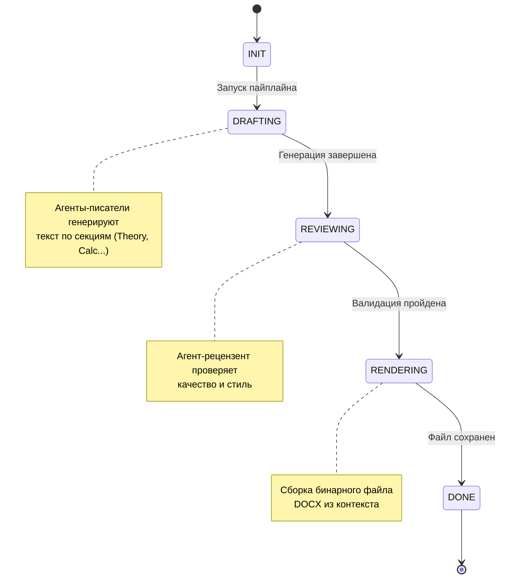
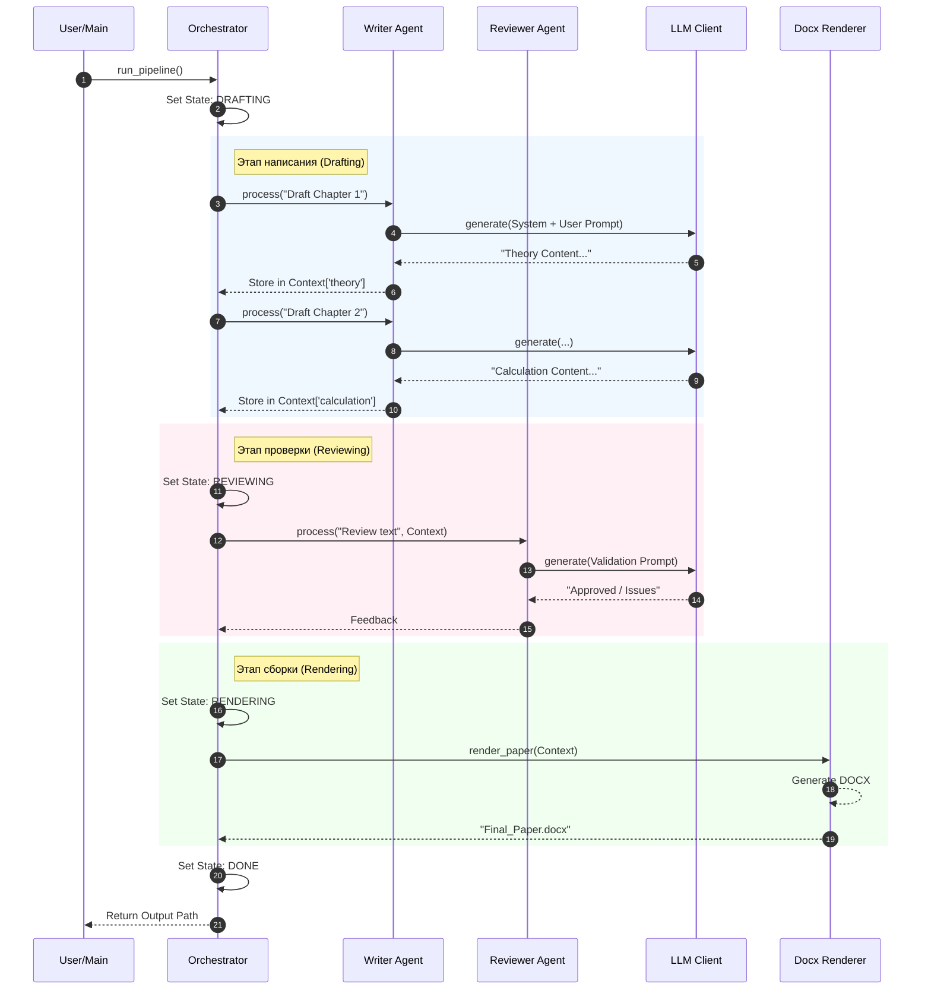

# Оркестрация и Поток Выполнения (Orchestration)

Оркестратор (`src/core/orchestrator.py`) реализует паттерн **Finite State Machine (FSM)**. Это гарантирует детерминированность процесса: генерация документа всегда проходит через строго определенные этапы.

## Диаграмма Состояний (State Machine)

## Последовательность Взаимодействия (Sequence Diagram)

Ниже показан типичный сценарий выполнения задачи:

## Логика Переходов

1.  **INIT**: Загрузка конфигурации `agents.yaml`, инициализация агентов и подключение к LLM.
2.  **DRAFTING**: Последовательный вызов `WriterAgent` для каждой секции документа. Результаты сохраняются в словарь `self.context`.
3.  **REVIEWING**: (Опционально) Отправка накопленного контекста агенту `ReviewerAgent`. В текущей версии MVP это линейный шаг, но архитектура позволяет реализовать цикл "Draft -> Review -> Fix -> Draft".
4.  **RENDERING**: Передача словаря `self.context` в чистую функцию `render_paper`.
5.  **DONE**: Завершение работы, возврат пути к файлу.
