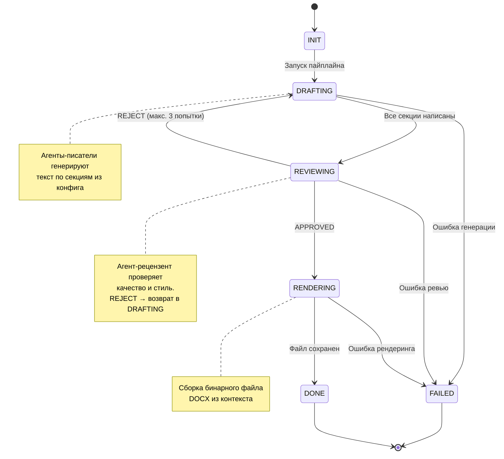
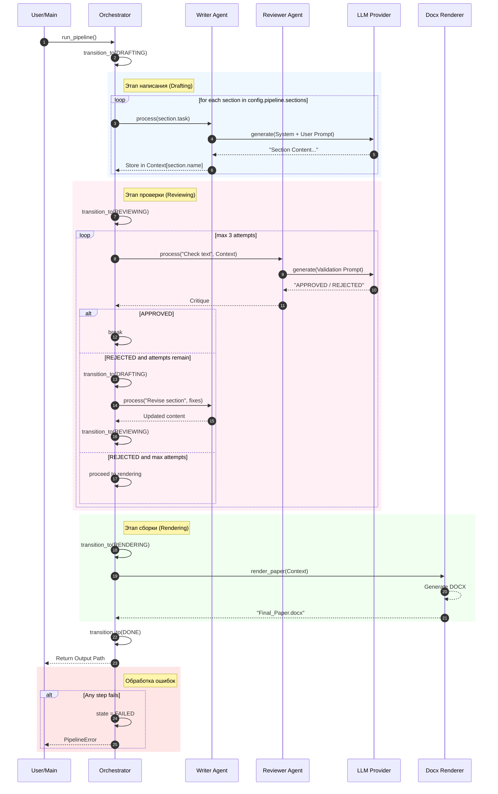

# Оркестрация и Поток Выполнения (Orchestration)

Оркестратор (`src/core/orchestrator.py`) реализует паттерн **Finite State Machine (FSM)** с таблицей переходов, guards и обработкой ошибок.

## Диаграмма Состояний (State Machine)

## Последовательность Взаимодействия (Sequence Diagram)

## Логика Переходов

1.  **INIT**: Загрузка конфигурации `agents.yaml`, инициализация агентов.
2.  **DRAFTING**: Последовательный вызов `WriterAgent` для каждой секции из `config.pipeline.sections`. Результаты сохраняются в `self.context`.
3.  **REVIEWING**: `ReviewerAgent` проверяет текст. Если `REJECTED` — возврат в `DRAFTING` (до 3 попыток). Если `APPROVED` или исчерпаны попытки — переход в `RENDERING`.
4.  **RENDERING**: Передача `self.context` в `render_paper`.
5.  **DONE**: Завершение, возврат пути к файлу.
6.  **FAILED**: Любая необработанная ошибка переводит пайплайн в это состояние. Вызывается `PipelineError`.

## Таблица Переходов

| Текущее состояние | Допустимые переходы |
|---|---|
| `INIT` | `DRAFTING` |
| `DRAFTING` | `REVIEWING` |
| `REVIEWING` | `DRAFTING`, `RENDERING` |
| `RENDERING` | `DONE` |
| `DONE` | — |
| `FAILED` | — |

Невалидный переход (например, `INIT → DONE`) вызывает `InvalidTransitionError`.
