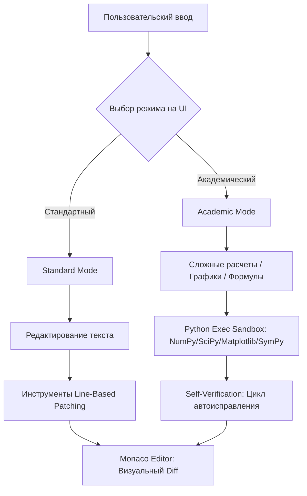

# Интеграция Вычислительной Песочницы и Редактора Monaco в Academic Pipeline

Данный документ описывает план интеграции изолированных петель обратной связи для агента, включающих точечное редактирование на базе Monaco Editor и вычислительную песочницу для выполнения кода (Academic Mode).

---

## Архитектура двух песочниц

Для решения проблемы хрупкости текстовых патчей (`Search/Replace`) и повышения точности расчетов система разделяется на два взаимодополняющих режима работы.

---

## Описание Режимов работы

### 1. Standard Mode (Стандартный текстовый режим)
Предназначен для общих текстов, где критично качество языка, а не расчеты.

*   **Агентские инструменты (Backend):** 
    *   Агент получает текст секций с номерами строк.
    *   Правки вносятся через специализированный инструмент `replace_lines(start_line, end_line, new_content)` вместо текстовых блоков `SEARCH/REPLACE`. Это полностью предотвращает ошибки сопоставления текста из-за разницы в форматировании.
*   **Интерфейс пользователя (Frontend):**
    *   Встраивание **Monaco Editor** для просмотра исходного кода секций и сгенерированных текстов в формате Markdown.
    *   Удобный Diff-Viewer для отображения точечных изменений, внесенных агентом.

### 2. Academic Mode (Академический вычислительный режим)
Предназначен для научных статей, содержащих математические модели, вычисления, сложные графики и таблицы данных.

*   **Агентские инструменты (Backend):**
    *   Доступ к изолированной Python-песочнице (например, через Docker-контейнер или изолированный виртуальный процесс) с предустановленными библиотеками: `numpy`, `pandas`, `matplotlib`, `sympy`, `scipy`.
    *   Возможность запускать написанный агентом Python-код для проведения расчетов и сохранения графиков в формате PNG/SVG.
    *   **Self-Verification Loop (Самопроверка):** Агент запускает код в песочнице перед отправкой рецензенту. Если возникает ошибка (Traceback), агент сам считывает ее и переписывает код.
*   **Результаты выполнения:**
    *   Результаты вычислений встраиваются в текст в виде точных цифр.
    *   Графики встраиваются в DOCX/PDF в виде сгенерированных изображений.
    *   Формулы автоматически конвертируются в безошибочный LaTeX через `sympy.latex()`.

---

## Изменения в Пользовательском Интерфейсе (UI)

> [!IMPORTANT]
> Переключатель режимов (**Standard** / **Academic**) должен располагаться на главном экране непосредственно рядом с панелью ввода темы и инструкций (Prompt Input Panel). Это позволит пользователю определить контекст генерации до запуска пайплайна.

### Макет панели ввода (на основе [search-bar.tsx](file:///f:/projects/Academic-Pipeline-Engine/ui/app/components/search-bar.tsx)):
*   Внедрение компонента `<Tabs>` или `<Select>` для выбора режима работы в заголовке или подвале формы.
*   Визуальное отличие: при включении **Academic Mode** подсвечивается значок "Академическая песочница активирована", показывая доступность научных библиотек.

---

## План работ по реализации

### Этап 1: Backend & Оркестрация
- [ ] Разработка системы нумерации строк для контекста секций.
- [ ] Реализация функции `replace_lines` для точечного патчинга контента.
- [ ] Обновление шаблонов ревизий в `academic_pe/core/prompting.py` для поддержки строковых диапазонов в ответах агента.
- [ ] Перенос логики обработки ошибок `SectionPatchError` на новую схему.

### Этап 2: Изолированная Python-песочница
- [ ] Создание изолированного контейнера/процесса выполнения кода.
- [ ] Подготовка базового окружения с предустановленными пакетами (`numpy`, `pandas`, `matplotlib`, `sympy`, `scipy`).
- [ ] Написание промптов для написания исполняемого кода агентом.
- [ ] Разработка логики перехвата ошибок исполнения (`sys.stderr`, `traceback`) и передачи их обратно агенту для самоисправления.

### Этап 3: Интеграция Frontend & Monaco Editor
- [ ] Интеграция Monaco Editor (например, `@monaco-editor/react`) в [live-document-canvas.tsx](file:///f:/projects/Academic-Pipeline-Engine/ui/app/components/live-document-canvas.tsx).
- [ ] Создание интерфейса визуального сравнения изменений (Diff View).
- [ ] Добавление переключателя режимов (Standard / Academic) на панели [search-bar.tsx](file:///f:/projects/Academic-Pipeline-Engine/ui/app/components/search-bar.tsx).
- [ ] Передача выбранного режима в API-запрос запуска пайплайна.

### Этап 4: Тестирование и валидация
- [ ] Написание тестов на точечный патчинг по строкам.
- [ ] Написание тестов на выполнение кода в песочнице и перехват исключений.
- [ ] Сквозные тесты пайплайна с построением графика через `matplotlib` и проверкой его наличия в экспортированном DOCX/PDF.
